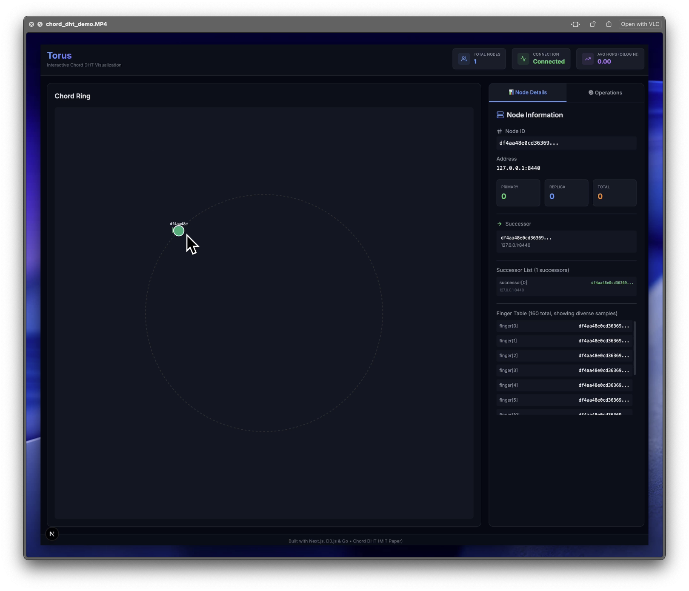

# Torus - Production-Ready Chord DHT with Interactive Visualization

A complete, full-stack implementation of the Chord Distributed Hash Table with a Go backend and Next.js frontend featuring real-time visualization and animated lookup path tracing.


---

## Table of Contents

- [Overview](#overview)
- [Features](#features)
- [Architecture](#architecture)
- [Backend Implementation](#backend-implementation)
- [Frontend Implementation](#frontend-implementation)
- [Getting Started](#getting-started)
- [API Documentation](#api-documentation)
- [Project Statistics](#project-statistics)
- [Educational Value](#educational-value)
- [Contributing](#contributing)
- [License](#license)

---

## Overview

Torus is a production-ready, full-stack Chord Distributed Hash Table (DHT) implementation that demonstrates distributed systems concepts through interactive visualization. The project consists of:

- **Backend**: Go-based Chord protocol with gRPC and HTTP API
- **Frontend**: Next.js 15 + React 19 interactive visualization dashboard
- **Complete Integration**: Real-time WebSocket updates + REST API

Based on the original [Chord paper](https://pdos.csail.mit.edu/papers/chord:sigcomm01/chord_sigcomm.pdf) from MIT (2001), this implementation provides:
- O(log N) distributed lookups
- Automatic key migration
- Fault tolerance via successor lists
- Real-time ring visualization
- Animated lookup path tracing

---

## Features

### Core Chord Protocol
- **160-bit identifier space** (2^160 addresses)
- **Finger table routing** (160 entries for O(log N) lookups)
- **Stabilization protocol** (runs every 3 seconds)
- **Successor lists** (r=8 for fault tolerance)
- **Complete key migration** during node join
- **Automatic routing** to responsible nodes

### Network Layer
- **gRPC transport** with 13 RPC methods
- **HTTP REST API** via grpc-gateway
- **WebSocket hub** for real-time updates
- **Connection pooling** with automatic lifecycle
- **Context-based timeouts** (5s default)

### Visualization
- **Interactive D3.js ring visualization**
- **Animated lookup path tracing** (shows O(log N) hops)
- **Node details panel** with finger table display
- **DHT operations panel** (Get/Set/Delete)
- **Live statistics dashboard**
- **Auto-discovery** of ring topology

### Production-Ready
- **Structured logging** with zerolog
- **Graceful shutdown** with signal handling
- **Thread-safe** operations with RWMutex
- **TTL support** with background cleanup

---

## Architecture

```
                FRONTEND (Next.js + React)
        +------------------------------------------+
        |  Ring        Node Details      Demo     |
        |  Visualizer  Panel             Ops      |
        |                                          |
        |  D3.js Visualization                     |
        +------------------------------------------+
                    |             |
         TorusAPI   |             |  WebSocket
         Client     |             |  Client
                    |             |
                HTTP/REST        WS
                    |             |
                    v             v
        +------------------------------------------+
        |           BACKEND (Go)                   |
        |                                          |
        |  HTTP API            WebSocket Hub       |
        |  (grpc-gateway)      (gorilla/websocket) |
        |       |                                  |
        |       v                                  |
        |  gRPC Server                             |
        |       |                                  |
        |       v                                  |
        |  ChordNode (Core Logic)                  |
        |  - Finger Table (160 entries)            |
        |  - Stabilization + FixFingers            |
        |  - FindSuccessor (O(log N))              |
        |  - Join with Key Migration               |
        |       |                                  |
        |       v                                  |
        |  ChordStorage (+ MemoryStorage)          |
        |  - TTL support                           |
        |  - Range queries                         |
        |  - Metadata persistence                  |
        +------------------------------------------+
```

---

## Demo Video

[](https://drive.google.com/file/d/1hO_KhT9nIRF90Y9hE9K505tVWTQyz1JF/view?usp=sharing)

---

## Backend Implementation

### Directory Structure

```
backend/
├── Makefile                        # Build automation
├── README.md                       # Backend documentation
├── TESTING_GUIDE.md                # Testing documentation
├── go.mod                          # Go module (Go 1.24.1)
├── go.sum                          # Dependency checksums
├── bin/
│   └── torus                       # Compiled binary
├── cmd/
│   └── torus/
│       └── main.go                 # Application entry point
├── internal/
│   ├── api/
│   │   ├── server.go               # HTTP API gateway
│   │   └── websocket.go            # WebSocket hub
│   ├── chord/
│   │   ├── broadcaster.go          # Ring update broadcaster
│   │   ├── node.go                 # Core ChordNode
│   │   ├── node_test.go            # Node tests
│   │   ├── remote.go               # RemoteClient interface
│   │   ├── storage.go              # ChordStorage wrapper
│   │   ├── storage_test.go         # Storage tests
│   │   ├── types.go                # NodeAddress, FingerEntry
│   │   └── types_test.go           # Types tests
│   ├── config/
│   │   ├── config.go               # Configuration
│   │   └── config_test.go          # Config tests
│   ├── hash/
│   │   ├── hash.go                 # SHA-256 hashing + ring arithmetic
│   │   └── hash_test.go            # Hash tests
│   └── transport/
│       ├── auth_interceptor.go     # gRPC authentication
│       ├── grpc_client.go          # gRPC client with pooling
│       ├── grpc_client_test.go     # Client tests
│       ├── grpc_server.go          # gRPC server
│       └── grpc_server_test.go     # Server tests
├── logs/                           # Log files (gitignored)
├── pkg/
│   ├── errors.go                   # Common error definitions
│   ├── logger.go                   # Structured logging (zerolog)
│   ├── logger_test.go              # Logger tests
│   ├── memory.go                   # In-memory storage with TTL
│   └── memory_test.go              # Memory storage tests
├── protobuf/
│   ├── proto/
│   │   └── chord.proto             # Protocol Buffer definitions
│   └── protogen/
│       ├── chord.pb.go             # Generated protobuf code
│       ├── chord.pb.gw.go          # Generated gRPC-gateway code
│       ├── chord_grpc.pb.go        # Generated gRPC service code
│       └── chord_test.go           # Protobuf tests
└── test/
    └── integration/
        └── multi_node_test.go      # Integration tests
```

### Core Components

#### 1. **ChordNode**

The heart of the implementation:

```go
type ChordNode struct {
    id            *big.Int          // 160-bit node ID
    fingerTable   []*FingerEntry    // 160 entries for O(log N) routing
    successorList []*NodeAddress    // r=3 successors for fault tolerance
    predecessor   *NodeAddress      // Ring predecessor
    storage       *ChordStorage     // Key-value storage
    remote        RemoteClient      // RPC client interface
    // ... lifecycle management
}
```

**Key Methods**:
- `Create()`: Initialize single-node ring
- `Join(bootstrap)`: Join existing ring with complete key migration
- `FindSuccessor(id)`: O(log N) recursive lookup using finger table
- `Stabilize()`: Periodic ring maintenance (every 3s)
- `FixFingers()`: Update one finger table entry per iteration
- `Get/Set/Delete`: DHT operations with automatic routing
- `TransferKeys/DeleteTransferredKeys`: Two-phase key migration

#### 2. **Hashing**

Consistent hashing implementation:

```go
const M = 160 // 2^160 identifier space

// SHA-256 truncated to 160 bits
func HashKey(data []byte) *big.Int

// Ring arithmetic
func InRange(id, start, end *big.Int) bool
func Distance(start, end *big.Int) *big.Int
func AddPowerOfTwo(n *big.Int, exponent int) *big.Int
```

#### 3. **Storage** 

Chord-specific storage wrapper:

```go
type ChordStorage struct {
    storage *pkg.MemoryStorage
}

// User data (hashed keys)
func (cs *ChordStorage) Get(key string) ([]byte, error)
func (cs *ChordStorage) Set(key string, value []byte, ttl time.Duration) error

// Metadata (raw keys)
func (cs *ChordStorage) GetPredecessor() (*NodeAddress, error)
func (cs *ChordStorage) SetSuccessorList(list []*NodeAddress) error
func (cs *ChordStorage) GetFingerEntry(index int) (*FingerEntry, error)

// Key migration
func (cs *ChordStorage) GetKeysInRange(startID, endID *big.Int) (map[string][]byte, error)
func (cs *ChordStorage) DeleteKeysInRange(startID, endID *big.Int) (int, error)
```

#### 4. **gRPC Transport** (`internal/transport/`)

**Server**:
Implements 13 RPC methods from `chord.proto`:

```protobuf
service ChordService {
  // Core Chord operations
  rpc FindSuccessor(FindSuccessorRequest) returns (FindSuccessorResponse);
  rpc GetPredecessor(GetPredecessorRequest) returns (GetPredecessorResponse);
  rpc Notify(NotifyRequest) returns (NotifyResponse);
  rpc GetSuccessorList(GetSuccessorListRequest) returns (GetSuccessorListResponse);

  // DHT operations
  rpc Get(GetRequest) returns (GetResponse);
  rpc Set(SetRequest) returns (SetResponse);
  rpc Delete(DeleteRequest) returns (DeleteResponse);

  // Key migration
  rpc TransferKeys(TransferKeysRequest) returns (TransferKeysResponse);
  rpc DeleteTransferredKeys(DeleteTransferredKeysRequest) returns (DeleteTransferredKeysResponse);

  // Utility
  rpc Ping(PingRequest) returns (PingResponse);
  rpc GetNodeInfo(GetNodeInfoRequest) returns (GetNodeInfoResponse);
  rpc ClosestPrecedingFinger(ClosestPrecedingFingerRequest) returns (ClosestPrecedingFingerResponse);
}
```

**Client**:
- Connection pooling with automatic lifecycle
- Handles connection state (SHUTDOWN, READY, IDLE)
- Context-based timeouts with fallback

#### 5. **HTTP API Gateway**

Uses grpc-gateway to auto-generate REST API:

```go
// HTTP endpoints (auto-generated from protobuf)
POST   /api/keys              # Set key-value
GET    /api/keys/{key}        # Get value
DELETE /api/keys/{key}        # Delete value
GET    /api/node/info         # Node information
GET    /api/node/successors   # Successor list
GET    /api/node/predecessor  # Predecessor
GET    /api/node/fingers      # Finger table
GET    /api/lookup/{key}      # Lookup path visualization
POST   /api/node/ping         # Health check
GET    /health                # Health endpoint
```

#### 6. **WebSocket Hub**

Goroutine-based WebSocket manager:

```go
type WebSocketHub struct {
    clients    map[*client]bool
    broadcast  chan []byte
    register   chan *client
    unregister chan *client
}

// Broadcast ring updates to all connected clients
func (h *WebSocketHub) BroadcastRingUpdate(update any) error
```

Features:
- Ping/Pong keep-alive (60s timeout)
- Slow client detection and disconnection
- Graceful shutdown with WaitGroup

### Testing

```bash
# Run tests
make test

# Run with coverage
make test-coverage

# View coverage report
make test-coverage-report
```

---

## Frontend Implementation

### Technology Stack

- **Framework**: Next.js 15 (App Router)
- **React**: Version 19
- **Visualization**: D3.js v7.9
- **UI**: Tailwind CSS + lucide-react icons
- **Language**: TypeScript 5


### Directory Structure

```
frontend/
├── next-env.d.ts               # Next.js TypeScript declarations
├── next.config.ts              # Next.js configuration
├── package.json                # npm dependencies
├── package-lock.json           # npm lock file
├── postcss.config.mjs          # PostCSS configuration
├── tailwind.config.ts          # Tailwind CSS configuration
├── tsconfig.json               # TypeScript configuration
├── app/
│   ├── globals.css             # Global styles
│   ├── layout.tsx              # Root layout
│   └── page.tsx                # Main page
├── components/
│   ├── DemoOperations.tsx      # DHT operations panel
│   ├── NodeDetailsPanel.tsx    # Node details panel
│   ├── RingVisualization.tsx   # D3.js ring visualization
│   └── StatisticsDashboard.tsx # Statistics panel
├── lib/
│   ├── api.ts                  # REST API client
│   ├── constants.ts            # Event type constants
│   └── websocket.ts            # WebSocket client
└── types/
    └── chord.ts                # TypeScript interfaces
```

### Key Components

#### 1. **Ring Visualization**

**The Star Feature** - Advanced D3.js visualization:

```typescript
export default function RingVisualization({
  nodes,
  onNodeClick,
  selectedNode,
  lookupPath,           // For animated lookup
  lookupResponsibleNode // Final destination
})
```

**Features**:
- **Circular layout**: Nodes positioned by hash ID on ring (2^160 space)
- **Successor arrows**: Green dashed lines with arrowheads
- **Node labels**: First 8 hex chars of ID
- **Interactive**: Click to select, hover effects
- **Lookup animation**:
  - Draws arrows hop-by-hop
  - Shows hop numbers ("Hop 1", "Hop 2"...)
  - Highlights path nodes in amber
  - Green arrow to final responsible node
  - Staggered animation (600ms per hop)

**Example Flow**:
```
User searches "test123" 
Frontend calls /api/lookup/test123 
Backend: Node A , Node B , Node C (responsible) 
Frontend: Animates A, B, C with colored arrows
```

#### 2. **Node Details Panel**

Displays comprehensive node information:

```typescript
export default function NodeDetailsPanel({ node: ChordNode | null })
```

**Shows**:
- Node ID (hex format, truncated)
- Network address (host:port)
- **Stored key count** (updated after operations)
- Successor info with ID
- Predecessor info with ID
- **Finger table**: Exponentially sampled entries
  - Shows indices: [0,1,2,3,4,5,10,20,40,80,159]
  - Demonstrates finger table structure

#### 3. **Demo Operations**

Interactive DHT operations panel:

```typescript
export default function DemoOperations({
  nodes,
  onLookupSimulation,
  onOperationComplete
})
```

**Operations**:
- **Get**: Retrieve value by key
- **Set**: Store key-value pair
- **Delete**: Remove key
- **Visualize Lookup**: Animate the lookup path

**Features**:
- Tab-based operation selector
- Input validation
- Loading states
- Success/error feedback
- Base64 encoding/decoding
- Auto-refresh node details

#### 4. **Statistics Dashboard**

Live metrics display:

```typescript
export default function StatisticsDashboard({
  nodes: ChordNode[],
  isConnected: boolean
})
```

**Metrics**:
- **Total Nodes**: Ring size
- **Connection Status**: WebSocket state
- **Average Hops**: Calculated as O(log N) = log2(nodes)

#### 5. **API Client**

RESTful client with type-safe methods:

```typescript
export class TorusAPI {
  async getNodeInfo(): Promise<ChordNode>
  async getSuccessors(): Promise<ChordNode[]>
  async getPredecessor(): Promise<ChordNode | null>
  async getFingerTable(): Promise<FingerEntry[]>

  // DHT operations
  async getKey(key: string): Promise<{ value: string; found: boolean }>
  async setKey(key: string, value: string, ttl?: number): Promise<{ success: boolean }>
  async deleteKey(key: string): Promise<{ success: boolean }>

  // Visualization
  async lookupPath(key: string): Promise<LookupPathResponse>

  // Ring discovery: walks successor chain
  async discoverRing(): Promise<ChordNode[]>
}
```

**Ring Discovery Algorithm**:
```typescript
// Autonomous ring discovery by following successors
async discoverRing() {
  const discovered = new Map<string, ChordNode>();
  let current = await this.getNodeInfo(); // Bootstrap node

  while (!visited.has(current.successor.id)) {
    discovered.set(current.id, current);
    current = await getNodeInfo(current.successor); // Follow successor
  }

  return Array.from(discovered.values());
}
```

#### 6. **WebSocket Client**

Event-driven WebSocket manager:

```typescript
export class ChordWebSocketClient {
  connect(): Promise<void>
  on(event: string, callback: (data: any) => void)
  disconnect()
}

// Usage
const ws = getWebSocketClient();
ws.on('ring_update', (data) => setNodes(data.nodes));
ws.on('connected', () => setIsConnected(true));
```

**Features**:
- Event emitter pattern
- Auto-reconnect (3s delay)
- Connection state tracking
- Singleton instance

#### 7. **Type Definitions**

Type-safe interfaces:

```typescript
export interface ChordNode {
  id: string;              // Base64 encoded
  host: string;
  port: number;
  httpPort?: number;
  successor?: ChordNode;
  predecessor?: ChordNode;
  fingerTable?: FingerEntry[];
  keyCount?: number;
}

export interface FingerEntry {
  start: string;           // Base64 encoded
  node: ChordNode | null;
}

export interface LookupPath {
  key: string;
  keyHash: string;
  path: ChordNode[];
  hops: number;
  responsibleNode: ChordNode;
}
```

---

## Getting Started

### Prerequisites

**Backend**:
- Go 1.21 or higher
- Protocol Buffers compiler (protoc)
- Make

**Frontend**:
- Node.js 18 or higher
- npm or yarn

### Installation

#### 1. Clone the repository

```bash
git clone <repository-url>
cd torus
```

#### 2. Backend Setup

```bash
cd backend

# Install development tools
make install-tools

# Generate protobuf code
make proto

# Run tests
make test

# Build binary
make build
```

#### 3. Frontend Setup

```bash
cd frontend

# Install dependencies
npm install

# Run development server
npm run dev
```

### Running the System

#### Start Backend Nodes

**Node 1** (Create new ring):
```bash
cd backend
./bin/torus --host 127.0.0.1 --port 8440 --http-port 8080
```

**Node 2** (Join existing ring):
```bash
cd backend
./bin/torus --host 127.0.0.1 --port 8441 --http-port 8081 --bootstrap 127.0.0.1:8440
```

**Node 3**:
```bash
cd backend
./bin/torus --host 127.0.0.1 --port 8442 --http-port 8082 --bootstrap 127.0.0.1:8440
```

#### Start Frontend

```bash
cd frontend
npm run dev
```

Open http://localhost:3000 in your browser.

### Docker Compose (Recommended)

```bash
docker-compose up
```

This starts:
- 3 Chord nodes
- Frontend dashboard
- Monitoring (Prometheus + Grafana)

---

## API Documentation

### REST API Endpoints

Base URL: `http://localhost:8080`

#### Node Information

```bash
# Get node info
GET /api/node/info

Response:
{
  "node": {
    "id": "base64-encoded-id",
    "host": "127.0.0.1",
    "port": 8440,
    "httpPort": 8080,
    "keyCount": 42
  }
}
```

```bash
# Get successor list
GET /api/node/successors

Response:
{
  "successors": [
    { "id": "...", "host": "127.0.0.1", "port": 8441 },
    { "id": "...", "host": "127.0.0.1", "port": 8442 }
  ]
}
```

```bash
# Get predecessor
GET /api/node/predecessor

Response:
{
  "predecessor": {
    "id": "...",
    "host": "127.0.0.1",
    "port": 8439
  }
}
```

```bash
# Get finger table
GET /api/node/fingers

Response:
{
  "entries": [
    { "start": "base64-id", "node": { "id": "...", "host": "...", "port": 8441 } },
    ...
  ]
}
```

#### DHT Operations

```bash
# Store key-value
POST /api/keys
Content-Type: application/json

{
  "key": "user:1234",
  "value": "base64-encoded-value",
  "ttl_seconds": 3600
}

Response:
{ "success": true }
```

```bash
# Retrieve value
GET /api/keys/user:1234

Response:
{
  "value": "base64-encoded-value",
  "found": true
}
```

```bash
# Delete key
DELETE /api/keys/user:1234

Response:
{ "success": true }
```

#### Lookup Path (for visualization)

```bash
# Get lookup path
GET /api/lookup/user:1234

Response:
{
  "key": "user:1234",
  "keyHash": "base64-encoded-hash",
  "path": [
    { "id": "...", "host": "127.0.0.1", "port": 8440 },
    { "id": "...", "host": "127.0.0.1", "port": 8441 }
  ],
  "hops": 1,
  "responsibleNode": { "id": "...", "host": "127.0.0.1", "port": 8441 }
}
```

#### Health Check

```bash
# Health check
GET /health

Response:
{ "status": "ok" }
```

### WebSocket API

```javascript
// Connect to WebSocket
const ws = new WebSocket('ws://localhost:8080/api/ws');

// Receive ring updates
ws.onmessage = (event) => {
  const data = JSON.parse(event.data);
  console.log('Ring update:', data);
};

// Message format
{
  "type": "ring_update",
  "nodes": [...],
  "timestamp": 1234567890
}
```

### gRPC API

For direct gRPC access, see `protobuf/proto/chord.proto`.

---

## Educational Value

This project is excellent for learning:

### Distributed Systems Concepts
1. **Consistent Hashing**: SHA-256 truncated to 160 bits
2. **DHT Routing**: O(log N) lookups via finger tables
3. **Stabilization**: Maintaining ring correctness
4. **Fault Tolerance**: Successor lists for redundancy
5. **Data Migration**: Two-phase key transfer during join

### Go Programming
1. **Concurrency**: Goroutines, channels, mutexes
2. **gRPC**: Remote procedure calls with Protocol Buffers
3. **Interfaces**: Clean abstraction (RemoteClient)
4. **Context**: Cancellation and timeouts
5. **Testing**: Unit tests with >90% coverage

### Web Development
1. **Next.js 15**: App Router, Server Components
2. **React 19**: Modern hooks, state management
3. **D3.js**: Data-driven visualizations
4. **WebSockets**: Real-time bidirectional communication
5. **TypeScript**: Type-safe frontend

### System Architecture
1. **gRPC-Gateway**: Auto-generate REST from protobuf
2. **Connection Pooling**: Efficient resource management
3. **Graceful Shutdown**: Clean lifecycle management
4. **Separation of Concerns**: Layered architecture

### Visualization
The **animated lookup path** makes abstract concepts concrete:
- Shows how finger tables enable O(log N) routing
- Demonstrates the "jump" behavior of Chord lookups
- Visualizes the circular nature of the identifier space

---

## Unique Features

### 1. Lookup Path Visualization
**Most Impressive Feature**

The frontend traces and animates the exact path a lookup takes through the ring:

```
User searches for "test123" 
Node A: checks finger table, forwards to Node B 
Node B: checks finger table, forwards to Node C 
Node C: responsible node, returns value 
Frontend: Animates A, B, C with colored arrows and hop labels
```

This makes the abstract O(log N) routing algorithm **visually understandable**.

### 2. Ring Discovery Algorithm
Frontend autonomously discovers all nodes by walking successor chain:
- No backend "list all nodes" endpoint needed
- Discovers topology dynamically
- Handles ring changes gracefully

### 3. Real-Time Updates
WebSocket broadcasts push changes to all clients:
- Node joins/leaves
- Ring topology updates
- Connection status

### 4. Key Count Tracking
Each node tracks stored keys:
- Displayed in node details
- Updated after Set/Delete operations
- Shows load distribution

### 5. Two-Phase Key Migration
Safe data transfer during node join:
1. **Transfer**: Copy keys to new node
2. **Delete**: Remove from old node after confirmation
3. **Prevents**: Data loss during migration

---

## Build Targets

### Backend Makefile

```bash
make proto                 # Generate protobuf code
make test                  # Run all tests
make test-coverage         # Run tests with coverage
make test-coverage-report  # Generate HTML coverage report
make build                 # Build binary to bin/torus
make clean                 # Clean generated files
make fmt                   # Format code
make lint                  # Run linter
make tidy                  # Tidy dependencies
make install-tools         # Install development tools
make check                 # Format + test
make all                   # Proto + test
```

### Frontend Scripts

```bash
npm run dev                # Start development server
npm run build              # Build for production
npm run start              # Start production server
npm run lint               # Run ESLint
```

---

## Contributing

Contributions are welcome! Please follow these guidelines:

1. Fork the repository
2. Create a feature branch (`git checkout -b feature/amazing-feature`)
3. Commit your changes (`git commit -m 'Add amazing feature'`)
4. Push to the branch (`git push origin feature/amazing-feature`)
5. Open a Pull Request

### Development Guidelines

**Backend**:
- Maintain >90% test coverage
- Follow Go best practices
- Update protobuf definitions if needed
- Run `make check` before committing

**Frontend**:
- Use TypeScript strict mode
- Follow React best practices
- Ensure responsive design
- Test on multiple browsers

---

## License

This project is licensed under the MIT License - see the LICENSE file for details.

---

## Acknowledgments

- **Golang**: The Go programming language
- **Chord Paper**: [Stoica et al., MIT 2001](https://pdos.csail.mit.edu/papers/chord:sigcomm01/chord_sigcomm.pdf)
- **gRPC**: Google's high-performance RPC framework
- **D3.js**: Data-Driven Documents for visualization
- **Next.js**: The React framework for production

---

## Contact

For questions, issues, or suggestions, please open an issue on GitHub or feel free to reach out anytime [hi@zde37.com](mailto:hi@zde37.com)

---

## Roadmap

### Current Version (v1.0)
- Complete Chord protocol
- gRPC + HTTP API
- Interactive visualization
- WebSocket real-time updates
- >90% test coverage

### Future Enhancements
- [ ] Persistent storage (BadgerDB)
- [ ] TLS/mTLS for security
- [ ] Prometheus metrics
- [ ] Grafana dashboards
- [ ] Kubernetes deployment
- [ ] Replication factor > 1
- [ ] Virtual nodes for load balancing
- [ ] Benchmark suite

---
